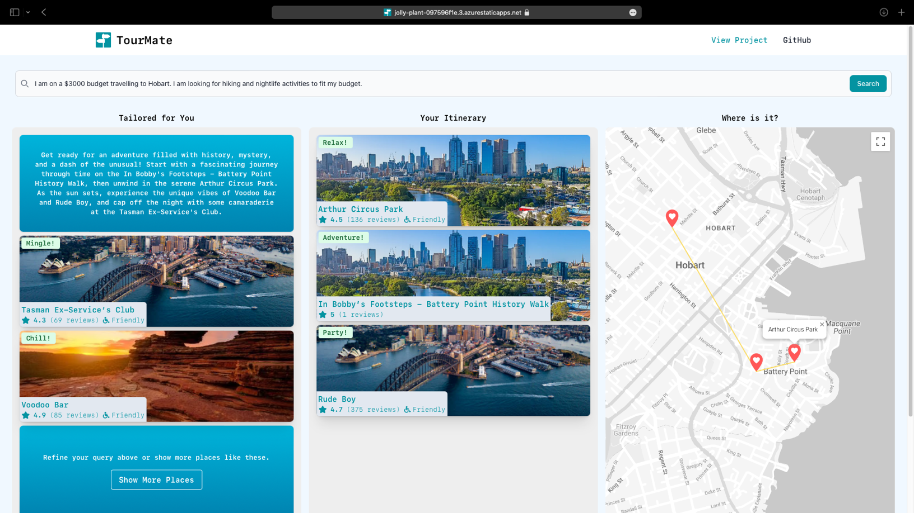

# TourMate

Welcome to our GovHack 2023 project - TourMate!

TourMate lets travellers create personalized itineraries by simply telling the app where they want to go and what they are looking to do, along with any accessibility requirements that they have to consider when traveling. The app then generates tailored recommendations that match their requests, along with user-friendly travel directions on a map. 

> Note: there is a bit of latency on the API calls, so please be patient when using the app. 😅

